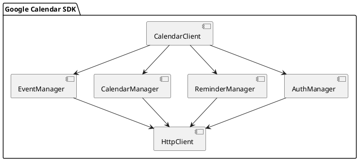
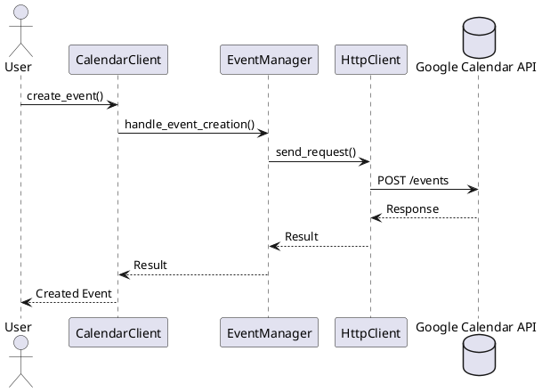
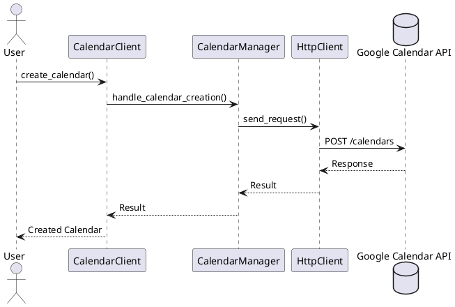
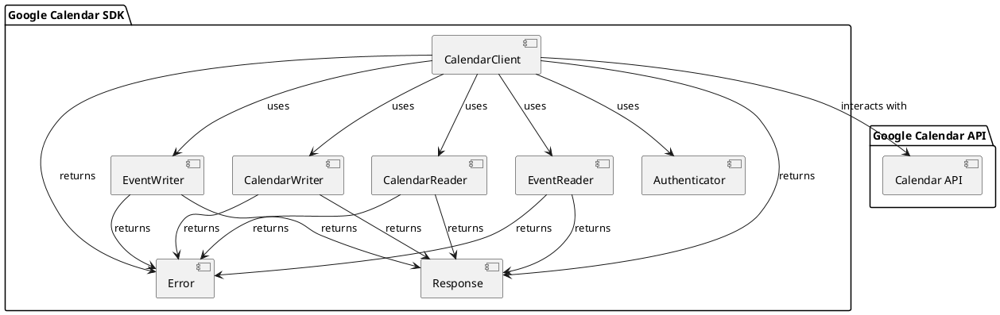

# Google Calendar SDK (Rust)

## 実装タスク

📝 **実装タスク一覧**

✅ 基盤構築
- ✅ プロジェクト初期設定
- 📝 HTTP クライアント実装
- 📝 エラー型定義
- 📝 設定管理

📝 認証・認可機能
- 📝 OAuth 2.0 フロー実装
- 📝 サービスアカウント認証サポート
- 📝 スコープ管理

📝 API 機能実装
- イベント管理 API
  - イベント作成機能
    - ✅ Event構造体の定義
    - 📝 基本的なイベント作成機能の実装（タイトル、説明、開始・終了時間）
    - 📝 参加者の追加機能
    - 📝 場所情報の追加機能
    - 📝 リマインダー設定機能
    - 📝 カラー設定機能
    - 📝 可視性（public/private）設定機能
    - 📝 ビデオ会議リンクの自動生成機能
  - イベント読み込み機能
    - 📝 イベントIDによる単一イベントの取得
    - 📝 日付範囲による複数イベントの取得
    - 📝 検索クエリによるイベントの検索
    - 📝 定期的なイベントの展開機能
    - 📝 更新されたイベントの同期機能
    - 📝 削除されたイベントの処理
  - 共通基盤
    - 📝 イベントのバリデーション機能
    - 📝 日時処理ユーティリティ
    - 📝 タイムゾーン処理
    - 📝 エラーハンドリング
    - 📝 レスポンスのデシリアライズ処理


📝 ユーティリティ機能
- 📝 エラーハンドリング補助機能
- 📝 リクエスト構築ヘルパー
- 📝 統合テストの作成

## PR実装計画

各機能は以下のPRに分割して実装を進めます：

### 進捗状況の説明
- ✅ DONE: 完了
- 🔄 IN PROGRESS: 作業中
- 📝 TODO: 未着手

### 📝 PR #1: HTTPクライアントとエラー型の基盤実装
- HTTP クライアント実装
- エラー型定義
- 設定管理の基本実装

### 📝 PR #2: Event構造体の基本実装
- Event構造体の定義
- シリアライズ/デシリアライズの実装
- 基本的なバリデーション機能

### 📝 PR #3: 基本的なイベント作成機能
- `create_event` メソッドの実装
- タイトル、説明、開始・終了時間の設定
- 基本的なレスポンス処理

### 📝 PR #4: イベント取得機能の実装
- `get_event` メソッドの実装
- イベントIDによる単一イベントの取得
- レスポンスのデシリアライズ処理

### 📝 PR #5: 日時処理とタイムゾーン対応
- 日時処理ユーティリティの実装
- タイムゾーン処理の実装
- 既存コードの日時処理の改善

### 📝 PR #6: イベントの拡張機能（その1）
- 参加者の追加機能
- 場所情報の追加機能
- 関連するテストの追加

### 📝 PR #7: イベントの拡張機能（その2）
- リマインダー設定機能
- カラー設定機能
- 可視性設定機能

### 📝 PR #8: 複数イベント取得と検索機能
- 日付範囲による複数イベントの取得
- 検索クエリによるイベントの検索
- ページネーション処理

### 📝 PR #9: ビデオ会議と高度な機能
- ビデオ会議リンクの自動生成機能
- 定期的なイベントの展開機能
- 更新されたイベントの同期機能

各PRの特徴：
1. 各PRは独立して機能する最小単位
2. テストも含めて完結するように設計
3. レビューしやすい適切なサイズ
4. 依存関係を考慮した順序

## 主要な要素

- **認証・認可**: OAuth 2.0 およびサービスアカウントによる認証・認可処理
- **イベント管理**: イベントの CRUD 操作、検索、定期的なイベントの管理
- **カレンダー管理**: カレンダーの CRUD 操作、共有設定の管理
- **リマインダー管理**: リマインダーの CRUD 操作、イベントとの関連付け

## `CalendarClient` 構造体

`CalendarClient` 構造体は、Google Calendar API とのインタラクションを管理する主要なクライアントです。

```rust
pub struct CalendarClient {
    http_client: HttpClient,
    auth_config: AuthConfig,
    base_url: String,
}
```

- `http_client`: HTTP リクエストを処理する内部クライアント
- `auth_config`: 認証設定を保持する構造体
- `base_url`: Google Calendar API のベース URL

### `CalendarClient` のメソッド

- `new(auth_config: AuthConfig) -> Result<Self>`: 新しいクライアントインスタンスを作成
- `create_event(event: Event) -> Result<Event>`: 新しいイベントを作成
- `get_event(event_id: &str) -> Result<Event>`: イベントを取得
- `update_event(event_id: &str, event: Event) -> Result<Event>`: イベントを更新
- `delete_event(event_id: &str) -> Result<()>`: イベントを削除

## PlantUML ダイアグラム



この図は、SDK の主要なコンポーネントとその関係を示しています。

## ユースケース

### 1. イベント管理

**目的**: Google Calendar のイベントを効率的に管理する

**実装タスク**:
- 📝 イベントの CRUD 操作の実装
- 📝 定期的なイベントの管理機能の実装
- 📝 イベント検索機能の実装
- 📝 テストケースの作成

**ユースケース例**:
- 会議スケジュールの自動登録
- イベントの一括更新
- 定期的なイベントの作成と管理



### 2. カレンダー管理

**目的**: Google Calendar の設定と共有を管理する

**実装タスク**:
- 📝 カレンダーの CRUD 操作の実装
- 📝 共有設定の管理機能の実装
- 📝 テストケースの作成

**ユースケース例**:
- 新しいカレンダーの作成
- カレンダーの共有設定の変更
- カレンダーリストの取得



## アーキテクチャ

SDKは以下のような構造で設計されています：



### コンポーネントの説明

#### Core Components
- **CalendarClient**: SDKのメインエントリーポイント。他のコンポーネントを統合し、APIとの対話を管理
- **Authenticator**: OAuth2.0認証とサービスアカウント認証を処理
- **Response**: API応答を標準化された形式でラップ
- **Error**: SDKのエラー型とエラーハンドリングを提供

#### Event Management
- **EventReader**: イベントの読み取り操作（取得、検索、リスト化）を担当
- **EventWriter**: イベントの書き込み操作（作成、更新、削除）を担当

#### Calendar Management
- **CalendarReader**: カレンダーの読み取り操作を担当
- **CalendarWriter**: カレンダーの書き込み操作を担当

### データフロー

1. クライアントからの要求は`CalendarClient`で受け付け
2. `Authenticator`で認証を処理
3. 操作の種類に応じて適切なReader/Writerコンポーネントにディスパッチ
4. Reader/WriterコンポーネントがGoogle Calendar APIと通信
5. 結果を`Response`または`Error`型でラップして返却

### エラーハンドリング

- 各コンポーネントは`Error`型を使用して一貫したエラーハンドリングを提供
- ネットワークエラー、認証エラー、APIエラーなどを適切に分類
- エラーメッセージは開発者にとって有用な情報を含む

### 設定管理

- 環境変数やコンフィグファイルからの設定読み込み
- APIエンドポイント、タイムアウト、リトライ設定などの管理
- 認証情報の安全な管理